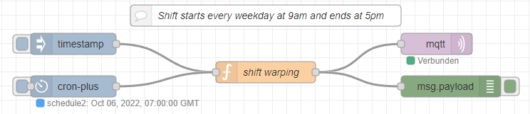

# addShift

This flow sets a shift for every weekday from 9 to 5 and adds those shifts to the database. It also allows starting a shift with a button press on the injector node.

## Prerequisites

Before using this template, make sure that you have installed the `node-red-contrib-cron-plus` package. If you need help installing new nodes/plugins in Node-RED, you can follow [this tutorial](https://learn.umh.app/course/how-to-install-new-nodes-plugins-in-node-red/).

## Usage
1. Install the `node-red-contrib-cron-plus` package if not already installed.
2. Import the `addShift` flow into your Node-RED instance.
3. Deploy the flow to your Node-RED instance.
4. The shift will automatically be set every weekday from 9 to 5 and added to the database.
5. To manually start a shift, press the button on the injector node.

