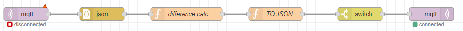

# Product Count

This flow counts the number of products produced by the machine. It measures the distance between the sensor and a grabbing head that takes the product from the machine and moves it into a box. If the distance goes below a certain threshold, it counts the product. This count does not sum up to an overall count; Grafana automatically does that. Counts can be floats, so the count is a message type that can mean different things depending on the context.

## Usage

1. Import the countTemplate-node-red JSON template into your Node-RED instance.
2. Configure the KafkaJS and MQTT nodes by adding your credentials and selecting the appropriate topics.
3. Deploy the flow.
