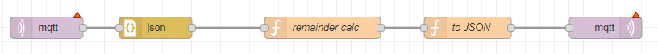

# Custom Processvalues

This Node-RED flow allows you to define custom process values by sending numerical or string messages with unique names. The topic structure needs to end with `/processValue/<unique name for your processvalue>` if the value is a number and `/processValueString/<unique name for your processvalue>` if it is a string. 

This basic template reads out a numerical message and sends a `/processvalue/evenodd` message that is either 0 if it is even or 1 if it is odd.

## Usage
1. Import the `processValueevenoddTemplate-node-red.json` template into your Node-RED instance.
2. Deploy the flow to your Node-RED instance.
3. To define custom process values, send a numerical or string message with a unique name, with topic structure ending in `/processValue/<unique name for your processvalue>` or `/processValueString/<unique name for your processvalue>`, respectively. 
4. The basic template reads out a numerical message and sends a `/processvalue/evenodd` message that is either 0 if it is even or 1 if it is odd. 
