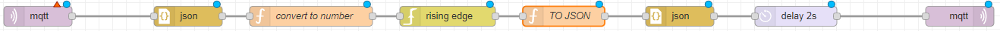

# DetectAnomaly

This Node-RED flow detects anomalies by taking a message that is sent when a machine is not working as intended. The flow takes the message in, converts it into a binary value (1 if true, 0 if false), and if an error message is coming in, it registers as 1 and goes through the rising edge node. Then a message is constructed and sent with the topic of `/detectedAnomaly` and a payload of the name of the error message to give you an idea of what went wrong.

If there are multiple messages that would count as an anomaly, you can even add additional branches to address all of them.

## Prerequisites
Before using this template, make sure that you have installed the `node-red-contrib-edge-trigger` package. If you need help installing new nodes/plugins in Node-RED, you can follow [this tutorial](https://learn.umh.app/course/how-to-install-new-nodes-plugins-in-node-red/).

## Usage
1. Install the `node-red-contrib-edge-trigger` package if not already installed.
2. Import the `detectedanomalyTemplate-node-red-json` template into your Node-RED instance.
3. Deploy the flow to your Node-RED instance.
4. Send a message with the unique name of the error message when the machine is not working as intended. The flow will convert the message into a binary value (1 if true, 0 if false) and send a `/detectedAnomaly` message with the name of the error message as payload.
