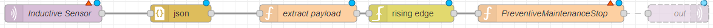

## MQTT Inductive Sensor

This Node-RED flow uses an inductive sensor to trigger a switch into a preventive maintenance stop (code 210000). It can be used for a variety of different purposes on a shopfloor.

## Prerequisites
Before using this template, make sure that you have installed the `node-red-contrib-edge-trigger` package. If you need help installing new nodes/plugins in Node-RED, you can follow [this tutorial](https://learn.umh.app/course/how-to-install-new-nodes-plugins-in-node-red/).

## Usage
1. Install the node-red-contrib-edge-trigger package if not already installed.
2. Import the inductiveTemplate-node-red.json template into your Node-RED instance.
3. Deploy the flow to your Node-RED instance.
4. The flow will trigger a preventive maintenance stop (code 210000) when the inductive sensor is triggered.
5. Customize the subflow as needed by double-clicking on it in the node library on the left.
