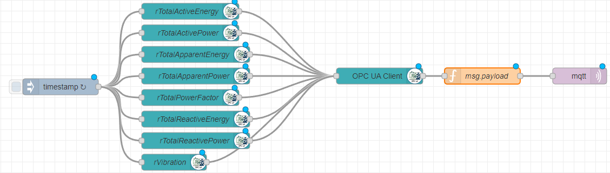

# OPC UA Input

This template allows you to process OPC UA type messages using Node-RED and the package `node-red-contrib-opcua`.

## Prerequisites

Before using this template, make sure that you have installed the `node-red-contrib-opcua` package. If you need help installing new nodes/plugins in Node-RED, you can follow [this tutorial](https://learn.umh.app/course/how-to-install-new-nodes-plugins-in-node-red/).

## Usage

1. Install the `node-red-contrib-opcua` package if not already installed.
2. Import the `opcuaTemplate-node-red.json` template into your Node-RED instance.
3. Deploy the flow to your Node-RED instance.
4. The timestamp node will start the flow every second, causing a request to the WAGO PLC every second and the Item nodes with the different topics are connected to the client, which reads the messages out and then gives them to the function.
5. The function clears null values and gives the message a topic based on the message type.
6. Be aware that it publishes them as `ia/raw/` messages and is not incorporated into our more sophisticated data model.
