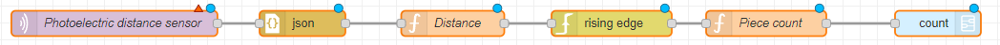

# Optical Distance Sensor for Conveyor Belt Item Counting

This template uses an optical distance sensor to count items passing through a checkpoint on a conveyor belt.

The rising-edge node is triggered when the distance is below the threshold listed in the node and is rising above it. Note that this flow uses a subflow to send the count message. Double-click on it in the node library on the left to open and customize the nodes in the subflow.

## Prerequisites

Before using this template, make sure that you have installed the `node-red-contrib-edge-trigger` package. If you need help installing new nodes/plugins in Node-RED, you can follow [this tutorial](https://learn.umh.app/course/how-to-install-new-nodes-plugins-in-node-red/).

## Usage

1. Install the `node-red-contrib-edge-trigger` package if not already installed.
2. Import the `odsTemplate-node-red.json` template into your Node-RED instance.
3. Deploy the flow to your Node-RED instance.
4. The rising-edge node is triggered when the distance is below the threshold listed in the node and is rising above it.
5. Open the subflow to customize the nodes in the subflow.
