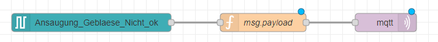
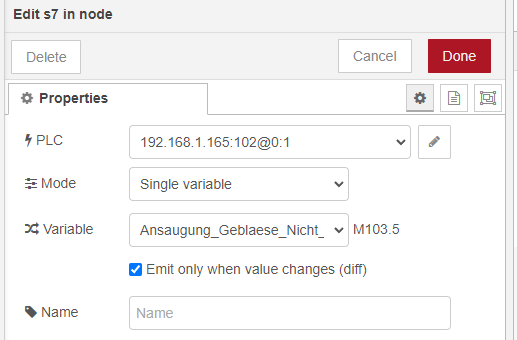

# Siemens S7 PLC Input

This Node-RED template is a simple S7 Input, which reads Siemens S7 PLC data and publishes it in the MQTT format using the MQTT-out node.

## Prerequisites
Before using this template, make sure that you have installed the `node-red-contrib-s7` package. If you need help installing new nodes/plugins in Node-RED, you can follow [this tutorial](https://learn.umh.app/course/how-to-install-new-nodes-plugins-in-node-red/).

## Usage

1. Set the IP address, port, rack, and slot values for your Siemens S7 PLC. You can obtain these variables from TIA Portal.
2. Set the frequency at which you want to query the data of the PLC.
3. Click on the "add" button to add the S7 Input node to your Node-RED flow.

The function replaces all null values with zeroes and processes the data into the MQTT format.
