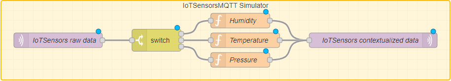
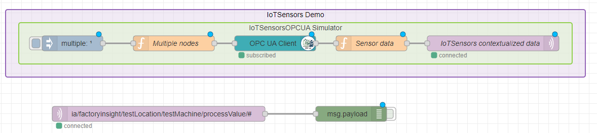

# Simulated Data Converters

These Node-RED flows provide templates to convert data from three simulators (iotsensorsmqtt, packmlsimulator, and opcuasimulator) into processvalue messages with the topic structure `ia/<customer>/<location>/<asset>/processValue/<measurement type>`.

## Prerequisites

Before using these templates, make sure that you have installed the `node-red-contrib-opcua` (for OPC-UA only) package. If you need help installing new nodes/plugins in Node-RED, you can follow [this tutorial](https://learn.umh.app/course/how-to-install-new-nodes-plugins-in-node-red/).

## Usage

1. Choose the appropriate template for your simulated data source:

  - To convert simulated MQTT data, import the `simulated-mqtt-data-flow.json` template into your Node-RED instance.
    

  - To convert simulated PackML data, import the `simulated-packml-flow.json` template into your Node-RED instance.
    

  - To convert simulated OPC-UA data, import the `simulated-opcua-flow.json` template into your Node-RED instance.
    

2. Deploy the flow to your Node-RED instance.

3. Send simulated machine messages containing the appropriate data (Humidity, Temperature, and Pressure for MQTT data; PackML data for PackML data; and OPC-UA data for OPC-UA data) to the flow.

4. The flow will convert the messages into processvalue messages with the appropriate topic structure and publish them as MQTT messages.

## Useful resources

- [UMH Data Acquisition and Manipulation guide](https://umh.docs.umh.app/docs/getstarted/dataacquisitionmanipulation/): A guide on how to format raw data into the UMH data model using Node-RED.

- [IoT-Sensors-Mqtt microservice documentation](https://umh.docs.umh.app/docs/architecture/microservices/community/mqttsim/): The technical documentation of the `iotsensorsmqtt` microservice, which simulates MQTT data.

- [Opcua-Simulator microservice documentation](https://umh.docs.umh.app/docs/architecture/microservices/community/opcua-simulator/): The technical documentation of the `opcuasimulator` microservice, which simulates OPC-UA data.

- [Packml-Simulator microservice documentation](https://umh.docs.umh.app/docs/architecture/microservices/community/packml-simulator/): The technical documentation of the `packmlsimulator` microservice, which simulates PackML data.
