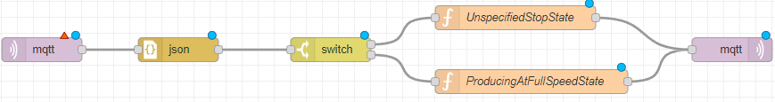
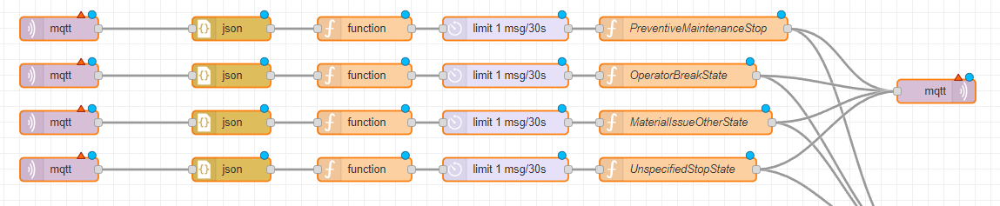

# State

This Node-RED flow provides two different ways to handle machine states. One way is to monitor the activity of the machine and extrapolate the state of the machine from it, and the other way is to get the machine state through manual input from a worker, e.g., through a button bar.

The first flow infers the machine state from the activity of the machine. When activity is 0, it sends a stop state, and when activity is 1, it sends a full speed state.

The second flow allows manual setting of more intricate states through a button bar. One example of such states could be a planned stop, a maintenance stop, or an operator break.

## Usage
1. Import the `state1Template-node-red.json` or `state2Template-node-red.json` template into your Node-RED instance, depending on which flow you want to use.
2. Deploy the flow to your Node-RED instance.
3. If using the first flow, monitor the activity of the machine to automatically infer the machine state. If using the second flow, use the button bar to manually set the machine state.
